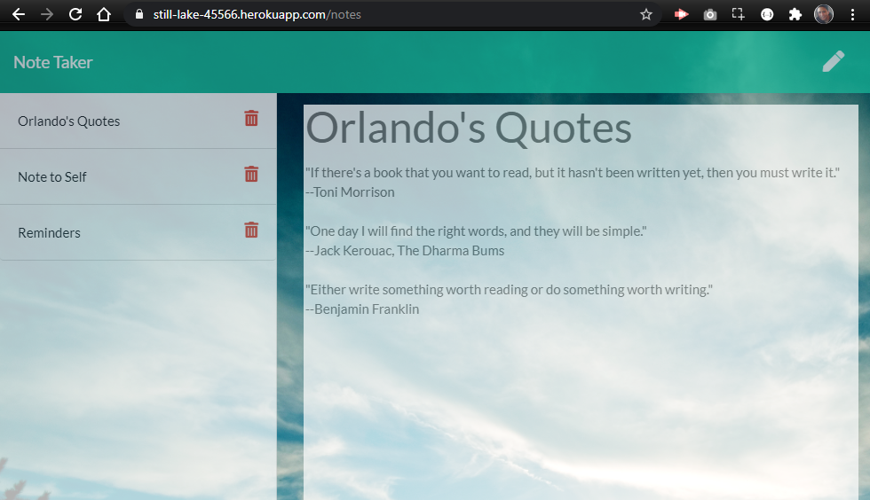

# Note Taker

:link: [View the deployed project](https://www.heroku.com/home)

A simple note-taking application built with [Express](https://expressjs.com/). Users can:
- Add notes
- Delete notes
- View existing notes

A user story, acceptance criteria and starter code were given for this assignment. The starter code contained all of the front-end assets as well as a sample object in the `db.json` file.

## Purpose
According to the user story, this application is meant to help users organize their thoughts and keep track of tasks.

## Built with
- [Node.js](https://nodejs.org/en/)
- [Express](https://expressjs.com/)
- [Bootstrap 4.5](https://getbootstrap.com/)
- [Font Awesome 5](https://fontawesome.com/)

## Deployed on
- [Heroku](https://www.heroku.com/home)

